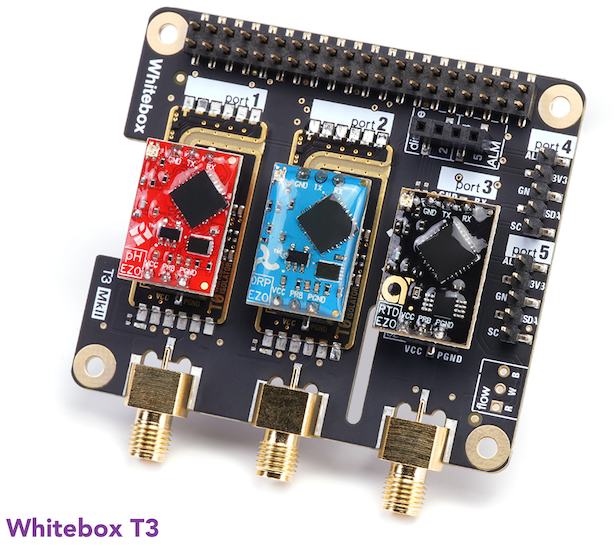

# 3 EZO Sensors Node

This node supports 3 sensors from the [Atlas Scientific EZO range](https://atlas-scientific.com/embedded-solutions/), which contains sensors and interface circuits for:

- Humidity
- pH
- ORP
- Dissolved Oxygen
- Conductivity (EC)
- Temperature
- Flow

## Hardware

The node uses a [Whitebox T3 Raspberry Pi Hat](https://www.whiteboxes.ch/shop/whitebox-t3-for-raspberry-pi/) which supports 2 fully isolated interfaces and 1 non-isolated.




This is combined with the Raspberry Pi Base-plate and a custom front panel to make the node.


The front panel contains just the power connector, the sensor sockets are accessible through the side of the case. The  design is available in file `3-sensors-front-panel.scad` or `3-sensors-fronf-panel.stl`


This is the circuit-diagram of the node hardware:


## Node-Types

Each sensor type its own set of commands and therefore its own driver. Different node-types can be created for different combinations of drivers.

#### PH_EC_TEMP_SENSORS

This node-type supports:

- a pH sensor (EZO_PH)
- an EC sensor (EZO_EC)
- a temperature sensor (EZO_RTD)

For each semsor there is 

- a `value` metric that publishes changes to the measured value
- a set of `calibration` metrics. These vary according to sensor type

EC

| Metric                          | Type    | Direction | Description                |
| ------------------------------- | ------- | --------- | -------------------------- |
| `/sensors/ec/value`             | double  | read      | Publishes ec value changes |
| `/sensors/ec/calibration/dry`   | double  | write     | Dry value calibration      |
| `/sensors/ec/calibration/low`   | double  | write     | Low ec value  calibration  |
| `/sensors/ec/calibration/high`  | double  | write     | High ec value calibration  |
| `/sensors/ec/calibration/clear` | boolean | write     | Clear calibration          |


pH

| Metric                          | Type    | Direction | Description                |
| ------------------------------- | ------- | --------- | -------------------------- |
| `/sensors/ph/value`             | double  | read      | Publishes ph value changes |
| `/sensors/ph/calibration/low`   | double  | write     | Low  ph value calibration  |
| `/sensors/ph/calibration/mid`   | double  | write     | Mid ph value calibration   |
| `/sensors/ph/calibration/high`  | double  | write     | High ph value calibration  |
| `/sensors/ec/calibration/clear` | boolean | write     | Clear calibration          |


Temp

| Metric                          | Type    | Direction | Description                   |
| ------------------------------- | ------- | --------- | ----------------------------- |
| `/sensors/rtd/value`            | double  | read      | Publishes temperature changes |
| `/sensors/rtd/calibration/temp` | double  | write     | Temperature calibration       |
| `/sensors/ec/calibration/clear` | boolean | write     | Clear calibration             |


**PH_EC_TEMP_SENSORS.yaml**

This is the node definition file:

```yaml
type : "PH_EC_TEMP_SENSORS"
name : "pH, EC and temperature sensors controller"
description : "Controller for EC, pH, temperature and water level sensors"
image: ""

drivers:
  - name : "ec-sensor"
    type: "ezo_ec"

    config:
      type : "i2c"
      device: 1
      address: 100

  - name: "ph-sensor"
    type: "ezo_ph"

    config:
      type : "i2c"
      device: 1
      address: 99

  - name: "temp-sensor"
    type: "ezo_rtd"

    config:
      type : "i2c"
      device: 1
      address: 102

metrics:
  - metricName: "/sensors/ec/value"
    type: "double"
    direction : "read"
    description: "Current ec value"
    driver: "ec-sensor"
    function: "value"

  - metricName: "/sensors/ec/calibration/dry"
    type: "double"
    direction: "write"
    description: "Calibration dry value"
    driver: "ec-sensor"
    function: "dry"

  - metricName: "/sensors/ec/calibration/low"
    type: "double"
    direction: "write"
    description: "Calibration low ec value"
    driver: "ec-sensor"
    function: "low"

  - metricName: "/sensors/ec/calibration/high"
    type: "double"
    direction: "write"
    description: "Calibration high ec value"
    driver: "ec-sensor"
    function: "high"

  - metricName: "/sensors/ec/calibration/clear"
    type: "boolean"
    direction: "write"
    description: "Clear calibration"
    driver: "ec-sensor"
    function: "clear"

  - metricName:  "/sensors/ph/value"
    type: "double"
    direction: "read"
    description: "Current ph value"
    driver: "ph-sensor"
    function: "value"

  - metricName: "/sensors/ph/calibration/low"
    type: "double"
    direction: "write"
    description: "Calibration low pH value"
    driver: "ph-sensor"
    function: "low"

  - metricName: "/sensors/ph/calibration/mid"
    type: "double"
    direction: "write"
    description: "Calibration mid pH value"
    driver: "ph-sensor"
    function: "mid"

  - metricName: "/sensors/ph/calibration/high"
    type: "double"
    direction: "write"
    description: "Calibration high pH value"
    driver: "ph-sensor"
    function: "high"

  - metricName: "/sensors/ph/calibration/clear"
    type: "boolean"
    direction: "write"
    description: "Clear calibration"
    driver: "ph-sensor"
    function: "clear"

  - metricName: "/sensors/rtd/value"
    type: "double"
    direction: "read"
    description: "Current temperature"
    driver: "temp-sensor"
    function: "value"

  - metricName: "/sensors/rtd/calibration/temp"
    type: "double"
    direction: "write"
    description: "Calibration temperature"
    driver: "temp-sensor"
    function: "temp"

  - metricName: "/sensors/rtd/calibration/clear"
    type: "boolean"
    direction: "write"
    description: "Clear calibration"
    driver: "temp-sensor"
    function: "clear"

```

