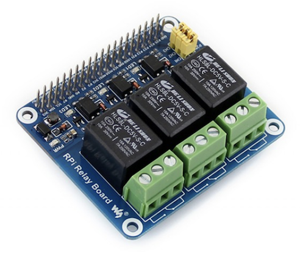
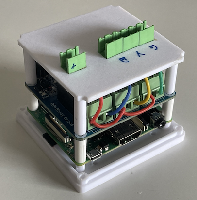
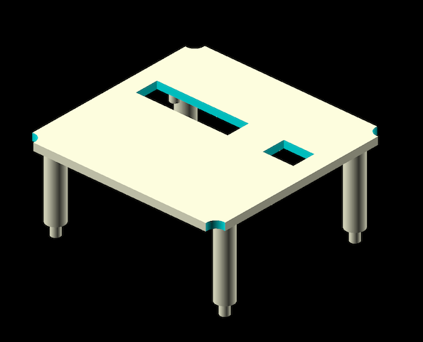
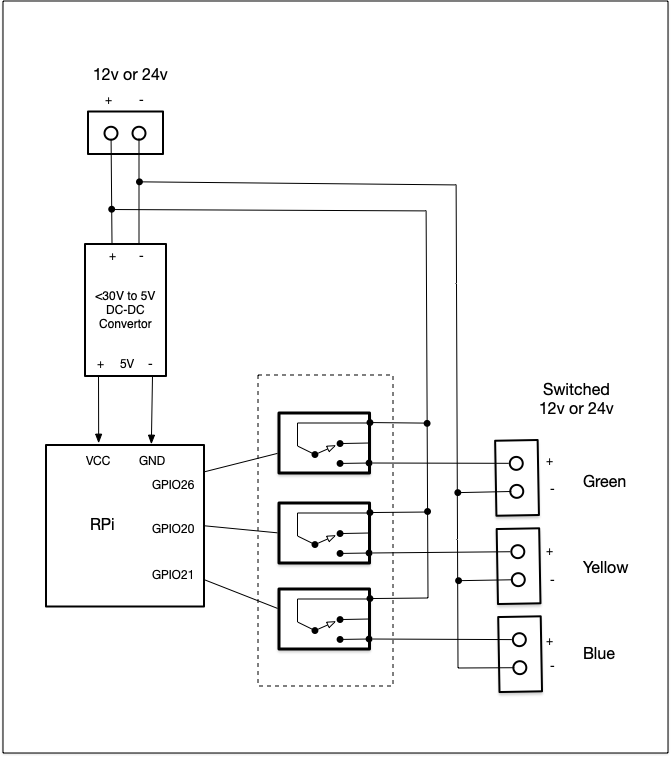

# 3 Relays Node

## Hardware

This node is based around a [Waveshare 11638 RPi Relay Board](https://www.waveshare.com/wiki/RPi_Relay_Board). This has 3 optically isolated relays capable of switching 250V AC @ 5A or 30V DC at 5A, however this hardware configuration only switching up to 30V DC is supported.

This is combined with the Raspberry Pi Base-plate and a custom front panel to make the node.

The front panel design is available in file `3-relays-front-panel.scad` or `3-relays-front-panel.stl`

This is the circuit dagram of the node hardware. 

## Firmware (Node Type)

### 3_RELAYS

This is simple firmware that simply changes the states of the 3 relays, and can be  used to control pumps, valves, lights etc.

The relays are identified and 'green', 'yellow' and 'blue' to match the colour coding on the hardware.

There are 3 metrics, one for each pump.

| Metric                 | Type    | Direction | Description        |
| ---------------------- | ------- | --------- | ------------------ |
| `/relays/green/state`  | boolean | write     | Green relay state  |
| `/relays/yellow/state` | boolean | write     | Yellow relay state |
| `/relays/blue/state`   | boolean | write     | Blue relay state   |

### 3_DOSING_PUMPS

This firmware is designed for controlling 3 peristatic pumps. It supports 

- operation by duration - where the pump will run for a given time in milliseconds
- operation by volume- where the pump will dispense a specific volume of liquid. This requires the pump to be calibrated amd a metric is provided for this.

As before the  pumps are identified and 'green', 'yellow' and 'blue' to match the colour coding on the hardware.

There are 3 groups of metrics:

Green

| Metric                      | Type   | Direction | Description                               |
| --------------------------- | ------ | --------- | ----------------------------------------- |
| `/dosers/green/duration`    | int64  | write     | Duration dose (in milliseconds)           |
| `/dosers/green/volume`      | int64  | write     | Volume dose (volume in millilitres)       |
| `/dosers/green/calibration` | double | write     | Dose calibration (millilitres per second) |

Yellow

| Metric                       | Type   | Direction | Description                               |
| ---------------------------- | ------ | --------- | ----------------------------------------- |
| `/dosers/yellow/duration`    | int64  | write     | Duration dose (in milliseconds)           |
| `/dosers/yellow/volume`      | int64  | write     | Volume dose (volume in millilitres)       |
| `/dosers/yellow/calibration` | double | write     | Dose calibration (millilitres per second) |

Blue

| Metric                     | Type   | Direction | Description                               |
| -------------------------- | ------ | --------- | ----------------------------------------- |
| `/dosers/blue/duration`    | int64  | write     | Duration dose (in milliseconds)           |
| `/dosers/blue/volume`      | int64  | write     | Volume dose (volume in millilitres)       |
| `/dosers/blue/calibration` | double | write     | Dose calibration (millilitres per second) |

