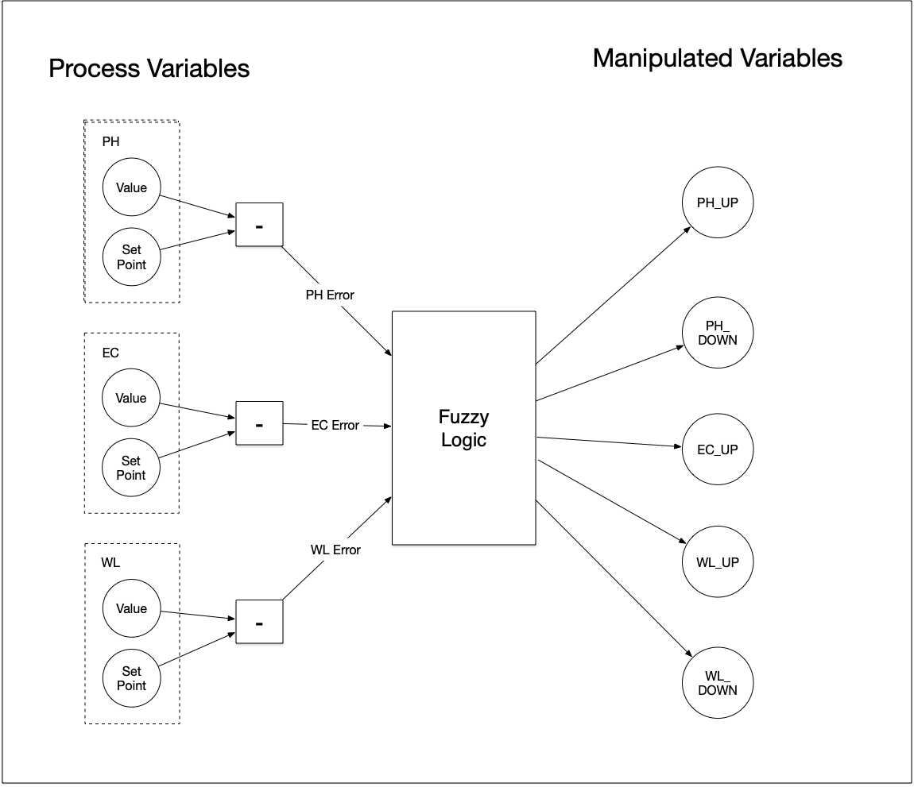
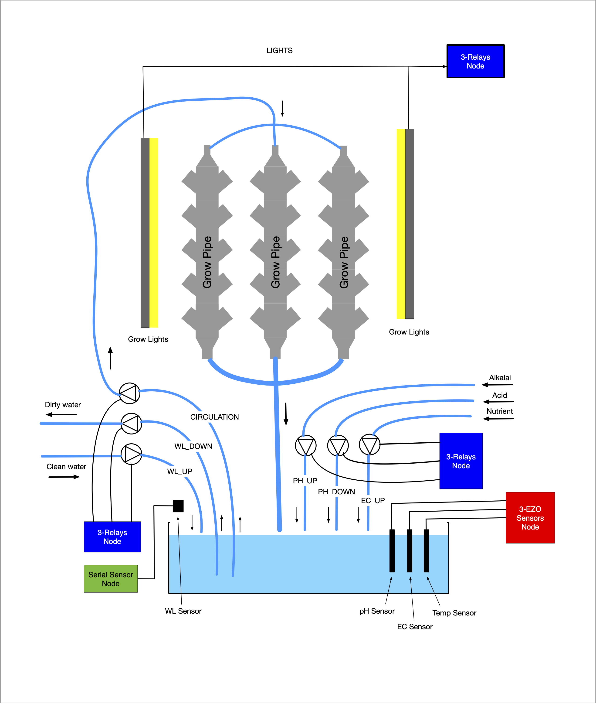

# Grow-tower Control Concepts

## Control Objectives

The Greenglass control algorithms will continuously and precisely manage a number of aspects of the hydroponics process and its environment:

- **pH Level** - the pH level is continuously maintained at a specified level (the set-point) which can be different in different phases of the growth cycle.
- **Nutrient-level** - the nutrient level is measured as the elctrical conductivity (EC) of the water. This is maintained at a specified level (the set-point)
- **Water-level** - water will be lost through evaporation and absorption so teh control algorithm will maintaim the level within specific bounds.
- **Water quality**  - the water quality will degrade over time, the control algorithm will be able ro replace the water periodically.

## Control Mechanisms and Interactions

### pH 

The pH level is increased by adding controlled amounts of alkalai to the water, conversely the pH level is reduced by adding controlled amounts of acid. 

The amounts are small relative to the volumn of water so they will not significantly affect the water level. 

Changing the pH may have a slight effect on EC.

### EC

The EC level can be increased by adding controlled amounts of nutrient to the water. The amounts will be small relative to the volumn of water so they will not significantly affect the water level.

To lower the EC means diluting its concentration in the water by adding fresh water.  Unless the amount is verty small, a comensurate amount of water will have to be removed from the tank.

The dilution may also lower  the pH value of the water, and a compensatory adjustment of the pH level would have to be made.

###  Water Level

A low water-level will be recified  by adding controlled amounts of fresh water. 

This may have the side-effect of reducing the EC and pH, and compensatory adjustments of these would have to be made.

### Water Quality

This is a one shot operation that involves emptying the tank completely and refilling it with fresh water. Both the pH and EC levels will have to be reset to their current set-point values.

## Controllers

### Process Variables 

**Process variables** represent the values that are controlled by the system. They contain two parts:

- **The current value** - typically measured by a sensor
- **The required value** - know as the set-point

The difference between the current value and the required valiue is the error, and it is the job of the control algorithm to reduce the error to zero.

### Manipulated Variables

Manipulated variables are used to change the state of the system. They are  used to drive pumps. valves, switches etc to bring the process variable error back to zero.

### Control Process

# pH, EC and Water Level Control

These three aspects are not independent and are controlled together. with a **fuzzy logic controller**, as shown in the following diagram:

### Process Variables

There are 3 process variables  used by this controller:

- PH - to control the pH level
- EC - to control the nutrient level
- WL - to control the water level

### Manipulated Variables

And 5 manipulated variables

- PH_UP -  value for a dosing pump to inject alkalai
- PH_DOWN -  value for dosing pump to inject acid
- EC_UP - value for dosing pump to inject nutrient
- WL_UP - value for  pump to add water
- WL_DOWN - value for pump to remove water

Controller

