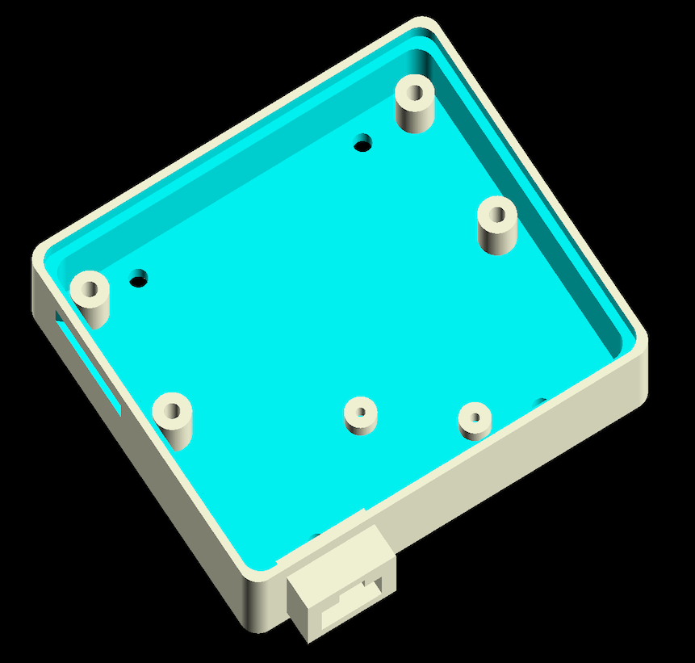
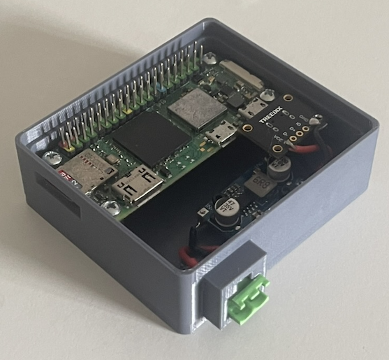

# Node Concept

## Introduction

Greenglass nodes are modular both in terms of hardware and software.

The hardware is based around the Raspberry Pi 2W. this is the smallest and cheapest of the Raspberry Pi Linux boards, and it costs about $15. Despite its small size and low costs it remains a powerful tool and quite adequate for running the GreenGlass Node software. The relevant specs for GreenGlass are:

- 1GHz quad-core 64-bit Arm Cortex-A53 CPU
- 512MB SDRAM
- 2.4GHz 802.11 b/g/n wireless LAN
- microSD card slot

- HAT-compatible 40-pin header

Persistent storage is provided by a microSD which contains the OS and the application. Mininum size 8GB

The 40 pin header contains the GPIO pins and power. This includes:

- Digital Inputs
- Digital Outputs
- PWM
- I2C
- SPI
- Serial

Note the Raspberry Pi does not natively support analog input and output, this requires an additional Hat board.

If the use case simply uses some of the above I/Os the node can be made just from the Pi Zero.  However in cases where it doesn't, the additional functionality must be supplied by extension boards or Hats which plug into the 40pin connector. The Hats be stacked allowing complex nodes to be created.

## The Hardware Concept

A node is made of a Rapsberry Pi Zero 2W and zero or more Pi Hats. To simplify the construction of this the project provide a set of 3D model files that allow individual case sections to be pinted for the Pi and each hat. These case sections can be pushed  together to form the node. The models are created in OpenSCAD and are parametric 

### The Base

The base simply contains the Raspberry Pi Zero 2W and a DC-DC onvretor allowing it to be powered from any DC power supply from 6 to 30V.

#### Bill of Materials

Apart from the Raspberry Pi, similar idems can be used.

| Name                 | Model                                            | Source                                                       |
| -------------------- | ------------------------------------------------ | ------------------------------------------------------------ |
| Raspberry Pi Zero 2W | WH (with headers) or WCH (with coloured headers) | [Cytron.io](https://th.cytron.io/c-raspberry-pi-main-board/p-raspberry-pi-zero-wh-with-header) |
| DC-DC convert        | Shockley DC 30V to 5V Buck Converter (Large)     | [Lazada](https://www.lazada.co.th/products/i4867844317-s20350357445.html?urlFlag=true&mp=1&tradePath=omItm&tradeOrderId=812206901102042&tradeOrderLineId=812206901202042&spm=spm%3Da2o42.order_details.item_title.1) |
| USB Breakout Board   | Treedix USB MicroB Plug Breakout Board           | [Amazon](https://www.amazon.com/dp/B09W2QHL2P?psc=1&ref=ppx_yo2ov_dt_b_product_details) |
| Power connector      | 2EDGK-5.08mm Terminal Block PCB 2P - straight    | [Lazada](https://www.lazada.co.th/products/i4904817251-s20671329968.html?urlFlag=true&mp=1&tradePath=omItm&tradeOrderId=821968396002042&tradeOrderLineId=821968396102042&spm=spm%3Da2o42.order_details.item_title.1) |

### 3D printed case

The 3D printed case provides mounting points for the Raspberry Pi and the DC-DC convertor. There is also a hole at the font to allow the terminal connector to be pushed through. and a slot cutout to allow access to the SD card.

This is contained in the file: 

`greenglass-hydroponics/hardware/node-sections/base.scad`

### Construction

)

