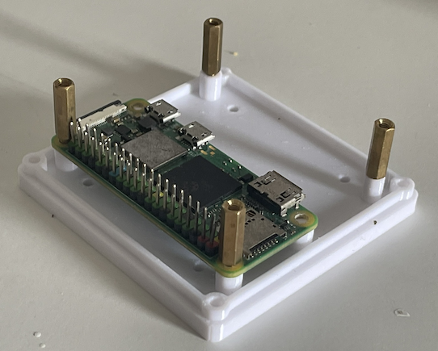
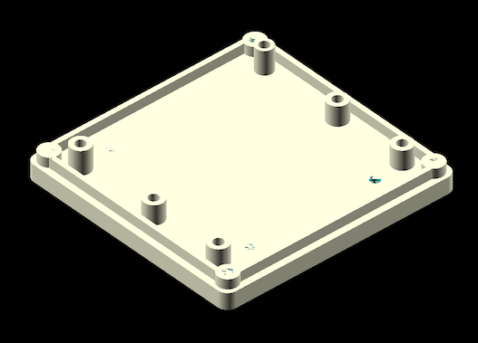
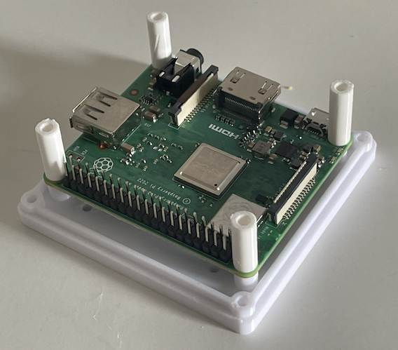

# Node Concept

Greenglass nodes are based around

[Raspberry Pi 3A+](https://www.raspberrypi.com/products/raspberry-pi-3-model-a-plus/) (approx £20)

[Raspberry Pi Zero 2W](https://www.raspberrypi.com/products/raspberry-pi-zero-2-w/) (approx $17)

## Node Base

### Raspberry Pi Zero 2W

The base is 3d printed and the design is contained in the file `pi0-base.scad` or `pi0-base.stl`

### Raspberry Pi 3A+

